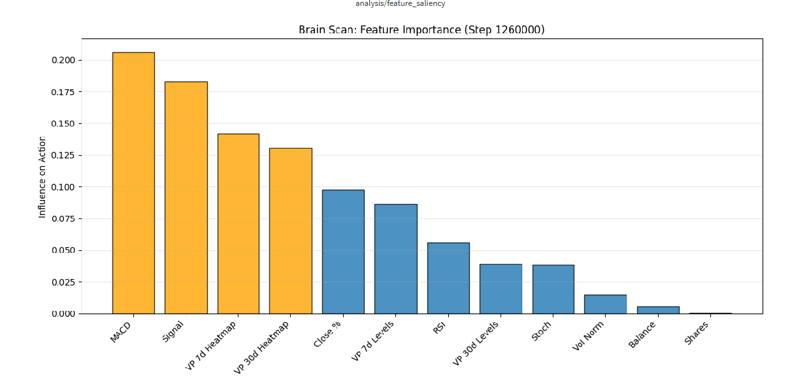

# 🤖 AI Trading Bot 3: Deep Reinforcement Learning for Crypto

   

An AI-powered trading bot using **RecurrentPPO (LSTM)** for temporal memory and advanced feature engineering.

Unlike basic bots that use simple indicators, this agent "sees" the market structure through **Volume Profiles**, identifying high-value support/resistance zones (POC, VAH, VAL) combined with momentum indicators. It utilizes **Curriculum Learning** to evolve from aggressive profit-seeking to professional risk management.

---
## 🧠 v3.0 Architecture: RecurrentPPO
The bot has been upgraded from a standard MLP policy to a Recurrent Neural Network (LSTM).

- **Algorithm:** Recurrent Proximal Policy Optimization (RecurrentPPO) via `sb3-contrib`.
- **Temporal Memory:** Uses LSTM hidden states to remember past market conditions, eliminating the need for large input sliding windows.
- **Input Shape:** `Window_Size=1`. The model sees only the current candle; history is maintained internally by the LSTM.

## 📊 Advanced Feature Engineering

### 1. Decayed Divergence Signals
Standard divergence signals (RSI/Stoch higher lows vs Price lower lows) are sparse events (single timestep). 
- **Problem:** Standard AI models miss these "blips".
- **Solution:** **Signal Decay**. When a divergence is detected, the feature spikes to `1.0` and slowly decays (e.g., `*= 0.95`) over subsequent steps. This creates a "fading memory" trace the LSTM can easily latch onto.

### 2. Volume Profile Heatmap
- Dynamically calculates the Volume Profile (Price-by-Volume) for the last 7 and 30 days.
- Normalizes this into a **40-bin Heatmap** fed directly to the agent, allowing it to "see" support and resistance zones based on liquidity.

### 3. Interpretable AI (Saliency)
- Includes a custom `RecurrentFeatureSaliencyCallback`.
- Uses **Integrated Gradients** to visualize exactly which features (Volume, RSI, Trend) triggered a specific Buy/Sell decision, accounting for the LSTM's hidden state.

## 💰 Smart Reward Function (Anti-Churn)
To prevent the AI from "churning" (rapidly flipping Buy/Sell to farm tiny fluctuations), we implemented a **Dynamic Churn Penalty**:

- **Concept:** "Healthy" trades should last a minimum duration (e.g., 24 hours).
- **Mechanism:** 
  - If a trade is closed immediately (Step 1): **Max Penalty** (-0.5 reward).
  - If a trade is held for target duration (Step 24+): **Zero Penalty**.
  - Between 0-24 steps: Penalty decays linearly.
- **Result:** The agent learns patience and only enters trades where the expected profit outweighs the "Early Exit Fee".


## 🚀 Key Features

### 🧠 The Brain
*   **Algorithm:** Recurrent Proximal Policy Optimization (RecurrentPPO) via `sb3-contrib`.
*   **Network Architecture:** Recurrent Neural Network (LSTM) for temporal memory.
*   **Input Shape:** `Window_Size=1`. The model sees only the current candle; history is maintained internally by the LSTM.
*   **Parallel Processing:** Uses `SubprocVecEnv` to run **16 parallel traders** simultaneously on the CPU, feeding a GPU for massive throughput (1,000+ FPS).

### 👀 The Vision (Observation Space)
The bot receives a flattened vector containing:
1.  **Market Structure:** 7-Day and 30-Day **Volume Profiles** (Point of Control, Value Area High/Low) relative to current price.
2.  **Volume Heatmap:** A 40-bin normalized distribution of volume history.
3.  **Decayed Divergence Signals:** Fading memory traces of RSI/Stoch divergences.
4.  **Momentum:** RSI (14), Stochastic RSI (14).
5.  **Trend:** MACD Line + Signal Line.
6.  **State:** Current Portfolio Balance and Holdings.

### 🎓 The Education (Smart Reward Function - Anti-Churn)
To prevent the AI from "churning" (rapidly flipping Buy/Sell to farm tiny fluctuations), we implemented a **Dynamic Churn Penalty**:
*   **Concept:** "Healthy" trades should last a minimum duration (e.g., 24 hours).
*   **Mechanism:**
  - If a trade is closed immediately (Step 1): **Max Penalty** (-0.5 reward).
  - If a trade is held for target duration (Step 24+): **Zero Penalty**.
  - Between 0-24 steps: Penalty decays linearly.
*   **Result:** The agent learns patience and only enters trades where the expected profit outweighs the "Early Exit Fee".

### 🛡️ Robustness
*   **Train/Test Split:** Trains on historical data (e.g., 2017-2021) and rigorously evaluates on unseen future data (2022-2025) every 50k steps.
*   **Reality Simulation:** Includes **0.15% trading fees** and an "Inertia Penalty" to prevent spam-trading/scalping noise.

---
# Train with RecurrentPPO and 16 parallel environments
python main.py --algo recurrentppo --pair BTCUSDT --n-envs 16 --window-size 1 --device cuda --wandb

## 🛠️ Installation

### Prerequisites
*   Python 3.12+ (or Docker)
*   NVIDIA GPU (Recommended for speed)

### Option A: Local Install (Windows/Linux)
1.  **Clone the repo:**
    ```bash
    git clone https://github.com/zhivko/ai-trading-bot-3.git
    cd ai-trading-bot-3
    ```
2.  **Create venv:**
    ```bash
    python -m venv .venv
    source .venv/bin/activate  # or .venv\Scripts\Activate.ps1 on Windows
    ```
3.  **Install Dependencies:**
    *   *Note: For RTX 30/40/50 series, install PyTorch manually first to get CUDA support.*
    *  I built RTX5090 x64 drivers on win64 environment - hence --no-deps should be used (for more about build proces see below)
    ```bash
    pip install -r .\requirements.txt --no-deps
    ```

### Option B: Docker (Recommended for RTX 5090 / Newer Hardware)
If you have driver compatibility issues, run inside NVIDIA's optimized container.

```bash
docker pull nvcr.io/nvidia/pytorch:25.01-py3
docker run --gpus all -it --rm --ipc=host -v "c:\git\ai-trading-bot-3:/workspace/bot" nvcr.io/nvidia/pytorch:25.01-py3
```

## Results

EVAL REPORT (Step 4900000): ROI: 260.57% | Drawdown: 22.21%
| Section  | Metric          | Value     |
|----------|-----------------|-----------|
| rollout/ | ep_len_mean     | 1.95e+04  |
| rollout/ | ep_rew_mean     | 451       |
| time/    | episodes        | 252       |
| time/    | fps             | 1090      |
| time/    | time_elapsed    | 4520      |
| time/    | total_timesteps | 4930212   |
| train/   | actor_loss      | 4.76      |
| train/   | critic_loss     | 0.254     |
| train/   | ent_coef        | 0.00294   |
| train/   | ent_coef_loss   | 0.762     |
| train/   | learning_rate   | 0.0003    |
| train/   | n_updates       | 352150    |




## Output from logs
Below is example how to run from docker container.
```
root@c00ed23b4b46:/workspace/bot# python main.py --pair BTCUSDT --vp-days 7 30 --algo sac --test-split 2022-01-01 --total-timesteps 5000000 --wandb --device cuda --batch-size 4096

🧹 FRESH START DETECTED
   - Deleting old models in ./models/BTCUSDT...
✅ Cleanup complete. Starting fresh.
Loading: BTCUSDT_data.csv
✂️ Splitting data at 2022-01-01...
🚀 Speeding up with 14 Parallel Environments...
🔥 Warming up cache on Main Process...
DEBUG: raw_df columns after reset_index: ['date', 'open', 'high', 'low', 'close', 'volume']
DEBUG: Attempting to set index on column: 'date', available columns: ['date', 'open', 'high', 'low', 'close', 'volume']
--- Initializing Environment (VP Days: [7, 30]) ---
  [Cache] Found existing Volume Profile: vp_cache/vp_win7_d73ac5d92319be4a4e40ee2fd2f37bca.pkl
  [Cache] Loading... (this is fast)
  [Cache] Found existing Volume Profile: vp_cache/vp_win30_55658296082812756b7a010f89ef3274.pkl
  [Cache] Loading... (this is fast)
✅ Cache ready. Launching Swarm.
DEBUG: raw_df columns after reset_index: ['date', 'open', 'high', 'low', 'close', 'volume']
DEBUG: Attempting to set index on column: 'date', available columns: ['date', 'open', 'high', 'low', 'close', 'volume']
--- Initializing Environment (VP Days: [7, 30]) ---
  [Cache] Found existing Volume Profile: vp_cache/vp_win7_d73ac5d92319be4a4e40ee2fd2f37bca.pkl
  [Cache] Loading... (this is fast)
  [Cache] Found existing Volume Profile: vp_cache/vp_win30_55658296082812756b7a010f89ef3274.pkl
  [Cache] Loading... (this is fast)
DEBUG: raw_df columns after reset_index: ['date', 'open', 'high', 'low', 'close', 'volume']
DEBUG: Attempting to set index on column: 'date', available columns: ['date', 'open', 'high', 'low', 'close', 'volume']
--- Initializing Environment (VP Days: [7, 30]) ---
  [Cache] Found existing Volume Profile: vp_cache/vp_win7_d73ac5d92319be4a4e40ee2fd2f37bca.pkl
  [Cache] Loading... (this is fast)
  [Cache] Found existing Volume Profile: vp_cache/vp_win30_55658296082812756b7a010f89ef3274.pkl
  [Cache] Loading... (this is fast)
DEBUG: raw_df columns after reset_index: ['date', 'open', 'high', 'low', 'close', 'volume']
DEBUG: Attempting to set index on column: 'date', available columns: ['date', 'open', 'high', 'low', 'close', 'volume']
--- Initializing Environment (VP Days: [7, 30]) ---
  [Cache] Found existing Volume Profile: vp_cache/vp_win7_d73ac5d92319be4a4e40ee2fd2f37bca.pkl
  [Cache] Loading... (this is fast)
  [Cache] Found existing Volume Profile: vp_cache/vp_win30_55658296082812756b7a010f89ef3274.pkl
  [Cache] Loading... (this is fast)
DEBUG: raw_df columns after reset_index: ['date', 'open', 'high', 'low', 'close', 'volume']
DEBUG: Attempting to set index on column: 'date', available columns: ['date', 'open', 'high', 'low', 'close', 'volume']
--- Initializing Environment (VP Days: [7, 30]) ---
  [Cache] Found existing Volume Profile: vp_cache/vp_win7_d73ac5d92319be4a4e40ee2fd2f37bca.pkl
  [Cache] Loading... (this is fast)
  [Cache] Found existing Volume Profile: vp_cache/vp_win30_55658296082812756b7a010f89ef3274.pkl
  [Cache] Loading... (this is fast)
DEBUG: raw_df columns after reset_index: ['date', 'open', 'high', 'low', 'close', 'volume']
DEBUG: Attempting to set index on column: 'date', available columns: ['date', 'open', 'high', 'low', 'close', 'volume']
--- Initializing Environment (VP Days: [7, 30]) ---
  [Cache] Found existing Volume Profile: vp_cache/vp_win7_d73ac5d92319be4a4e40ee2fd2f37bca.pkl
  [Cache] Loading... (this is fast)
  [Cache] Found existing Volume Profile: vp_cache/vp_win30_55658296082812756b7a010f89ef3274.pkl
  [Cache] Loading... (this is fast)
DEBUG: raw_df columns after reset_index: ['date', 'open', 'high', 'low', 'close', 'volume']
DEBUG: Attempting to set index on column: 'date', available columns: ['date', 'open', 'high', 'low', 'close', 'volume']
--- Initializing Environment (VP Days: [7, 30]) ---
  [Cache] Found existing Volume Profile: vp_cache/vp_win7_d73ac5d92319be4a4e40ee2fd2f37bca.pkl
  [Cache] Loading... (this is fast)
  [Cache] Found existing Volume Profile: vp_cache/vp_win30_55658296082812756b7a010f89ef3274.pkl
  [Cache] Loading... (this is fast)
DEBUG: raw_df columns after reset_index: ['date', 'open', 'high', 'low', 'close', 'volume']
DEBUG: Attempting to set index on column: 'date', available columns: ['date', 'open', 'high', 'low', 'close', 'volume']
--- Initializing Environment (VP Days: [7, 30]) ---
  [Cache] Found existing Volume Profile: vp_cache/vp_win7_d73ac5d92319be4a4e40ee2fd2f37bca.pkl
  [Cache] Loading... (this is fast)
  [Cache] Found existing Volume Profile: vp_cache/vp_win30_55658296082812756b7a010f89ef3274.pkl
  [Cache] Loading... (this is fast)
DEBUG: raw_df columns after reset_index: ['date', 'open', 'high', 'low', 'close', 'volume']
DEBUG: Attempting to set index on column: 'date', available columns: ['date', 'open', 'high', 'low', 'close', 'volume']
--- Initializing Environment (VP Days: [7, 30]) ---
  [Cache] Found existing Volume Profile: vp_cache/vp_win7_d73ac5d92319be4a4e40ee2fd2f37bca.pkl
  [Cache] Loading... (this is fast)
  [Cache] Found existing Volume Profile: vp_cache/vp_win30_55658296082812756b7a010f89ef3274.pkl
  [Cache] Loading... (this is fast)
DEBUG: raw_df columns after reset_index: ['date', 'open', 'high', 'low', 'close', 'volume']
DEBUG: Attempting to set index on column: 'date', available columns: ['date', 'open', 'high', 'low', 'close', 'volume']
--- Initializing Environment (VP Days: [7, 30]) ---
  [Cache] Found existing Volume Profile: vp_cache/vp_win7_d73ac5d92319be4a4e40ee2fd2f37bca.pkl
  [Cache] Loading... (this is fast)
  [Cache] Found existing Volume Profile: vp_cache/vp_win30_55658296082812756b7a010f89ef3274.pkl
  [Cache] Loading... (this is fast)
DEBUG: raw_df columns after reset_index: ['date', 'open', 'high', 'low', 'close', 'volume']
DEBUG: Attempting to set index on column: 'date', available columns: ['date', 'open', 'high', 'low', 'close', 'volume']
--- Initializing Environment (VP Days: [7, 30]) ---
  [Cache] Found existing Volume Profile: vp_cache/vp_win7_d73ac5d92319be4a4e40ee2fd2f37bca.pkl
  [Cache] Loading... (this is fast)
  [Cache] Found existing Volume Profile: vp_cache/vp_win30_55658296082812756b7a010f89ef3274.pkl
  [Cache] Loading... (this is fast)
DEBUG: raw_df columns after reset_index: ['date', 'open', 'high', 'low', 'close', 'volume']
DEBUG: Attempting to set index on column: 'date', available columns: ['date', 'open', 'high', 'low', 'close', 'volume']
--- Initializing Environment (VP Days: [7, 30]) ---
  [Cache] Found existing Volume Profile: vp_cache/vp_win7_d73ac5d92319be4a4e40ee2fd2f37bca.pkl
  [Cache] Loading... (this is fast)
  [Cache] Found existing Volume Profile: vp_cache/vp_win30_55658296082812756b7a010f89ef3274.pkl
  [Cache] Loading... (this is fast)
DEBUG: raw_df columns after reset_index: ['date', 'open', 'high', 'low', 'close', 'volume']
DEBUG: Attempting to set index on column: 'date', available columns: ['date', 'open', 'high', 'low', 'close', 'volume']
--- Initializing Environment (VP Days: [7, 30]) ---
  [Cache] Found existing Volume Profile: vp_cache/vp_win7_d73ac5d92319be4a4e40ee2fd2f37bca.pkl
  [Cache] Loading... (this is fast)
  [Cache] Found existing Volume Profile: vp_cache/vp_win30_55658296082812756b7a010f89ef3274.pkl
  [Cache] Loading... (this is fast)
DEBUG: raw_df columns after reset_index: ['date', 'open', 'high', 'low', 'close', 'volume']
DEBUG: Attempting to set index on column: 'date', available columns: ['date', 'open', 'high', 'low', 'close', 'volume']
--- Initializing Environment (VP Days: [7, 30]) ---
  [Cache] Found existing Volume Profile: vp_cache/vp_win7_d73ac5d92319be4a4e40ee2fd2f37bca.pkl
  [Cache] Loading... (this is fast)
  [Cache] Found existing Volume Profile: vp_cache/vp_win30_55658296082812756b7a010f89ef3274.pkl
  [Cache] Loading... (this is fast)
DEBUG: raw_df columns after reset_index: ['date', 'open', 'high', 'low', 'close', 'volume']
DEBUG: Attempting to set index on column: 'date', available columns: ['date', 'open', 'high', 'low', 'close', 'volume']
--- Initializing Environment (VP Days: [7, 30]) ---
  [Cache] Found existing Volume Profile: vp_cache/vp_win7_d73ac5d92319be4a4e40ee2fd2f37bca.pkl
  [Cache] Loading... (this is fast)
  [Cache] Found existing Volume Profile: vp_cache/vp_win30_55658296082812756b7a010f89ef3274.pkl
  [Cache] Loading... (this is fast)
DEBUG: raw_df columns after reset_index: ['date', 'open', 'high', 'low', 'close', 'volume']
DEBUG: Attempting to set index on column: 'date', available columns: ['date', 'open', 'high', 'low', 'close', 'volume']
--- Initializing Environment (VP Days: [7, 30]) ---
  [Cache] Found existing Volume Profile: vp_cache/vp_win7_976ae9ac9f3fb76ee8cf42c9211dd8ac.pkl
  [Cache] Loading... (this is fast)
  [Cache] Found existing Volume Profile: vp_cache/vp_win30_d171af62508219e5c2ea9a1bd85e837e.pkl
  [Cache] Loading... (this is fast)
✨ Creating NEW SAC Model on CUDA
Using cuda device
wandb: Currently logged in as: zhivko. Use `wandb login --relogin` to force relogin
wandb: wandb version 0.23.0 is available!  To upgrade, please run:
wandb:  $ pip install wandb --upgrade
wandb: Tracking run with wandb version 0.17.5
wandb: Run data is saved locally in /workspace/bot/wandb/run-20251130_194519-uq8nauli
wandb: Run `wandb offline` to turn off syncing.
wandb: Syncing run wise-feather-76
wandb: ⭐️ View project at https://wandb.ai/zhivko/ai-trading-bot
wandb: 🚀 View run at https://wandb.ai/zhivko/ai-trading-bot/runs/uq8nauli
--- STARTING TRAINING (5000000 steps) ---
Logging to ./sac_tb/SAC_1
Step 20600 [2019-12-27 12:00:00]: Price=7226 | POC=7206 (+0.29%) | NetWorth=10000 | MaxNetWorth=10000
Step 20500 [2019-12-23 08:00:00]: Price=7524 | POC=7156 (+5.14%) | NetWorth=10000 | MaxNetWorth=10000
Step 34400 [2021-07-25 13:00:00]: Price=34179 | POC=32242 (+6.01%) | NetWorth=9941 | MaxNetWorth=10000
Step 35400 [2021-09-05 09:00:00]: Price=50125 | POC=49803 (+0.65%) | NetWorth=13349 | MaxNetWorth=13529
Step 26600 [2020-09-03 00:00:00]: Price=11410 | POC=11386 (+0.22%) | NetWorth=11198 | MaxNetWorth=11876
Step 18900 [2019-10-17 12:00:00]: Price=8046 | POC=8314 (-3.21%) | NetWorth=7845 | MaxNetWorth=10085
Step 26000 [2020-08-09 00:00:00]: Price=11753 | POC=11226 (+4.69%) | NetWorth=10506 | MaxNetWorth=10972
...
2025-12-01 01:06:07
Step 33800 [2025-11-09 09:00:00]: P=101657 | POC=101835 (-0.17%) | Port=40824 | ATH=44480
2025-12-01 01:06:07
Step 33900 [2025-11-13 13:00:00]: P=102326 | POC=102104 (+0.22%) | Port=41128 | ATH=44480
2025-12-01 01:06:07
Step 34000 [2025-11-17 17:00:00]: P=92767 | POC=95762 (-3.13%) | Port=37501 | ATH=44480
2025-12-01 01:06:07
Step 34100 [2025-11-21 21:00:00]: P=85182 | POC=91469 (-6.87%) | Port=35849 | ATH=44480
2025-12-01 01:06:07
Step 34200 [2025-11-26 01:00:00]: P=87922 | POC=87333 (+0.67%) | Port=35696 | ATH=44480
2025-12-01 01:06:08
Eval num_timesteps=4900000, episode_reward=16.94 +/- 0.00
2025-12-01 01:06:08
Episode length: 29187.00 +/- 0.00
2025-12-01 01:06:08
---------------------------------
2025-12-01 01:06:08
| eval/              |          |
2025-12-01 01:06:08
|    mean_ep_length  | 2.92e+04 |
2025-12-01 01:06:08
|    mean_reward     | 16.9     |
2025-12-01 01:06:08
| time/              |          |
2025-12-01 01:06:08
|    total_timesteps | 4900000  |
2025-12-01 01:06:08
| train/             |          |
2025-12-01 01:06:08
|    actor_loss      | 4.7      |
2025-12-01 01:06:08
|    critic_loss     | 0.303    |
2025-12-01 01:06:08
|    ent_coef        | 0.00264  |
2025-12-01 01:06:08
|    ent_coef_loss   | -0.623   |
2025-12-01 01:06:08
|    learning_rate   | 0.0003   |
2025-12-01 01:06:08
|    n_updates       | 349992   |
2025-12-01 01:06:08
---------------------------------
2025-12-01 01:06:08

2025-12-01 01:06:08
EVAL REPORT (Step 4900000): ROI: 260.57% | Drawdown: 22.21%
| Section  | Metric          | Value     |
|----------|-----------------|-----------|
| rollout/ | ep_len_mean     | 1.95e+04  |
| rollout/ | ep_rew_mean     | 451       |
| time/    | episodes        | 252       |
| time/    | fps             | 1090      |
| time/    | time_elapsed    | 4520      |
| time/    | total_timesteps | 4930212   |
| train/   | actor_loss      | 4.76      |
| train/   | critic_loss     | 0.254     |
| train/   | ent_coef        | 0.00294   |
| train/   | ent_coef_loss   | 0.762     |
| train/   | learning_rate   | 0.0003    |
| train/   | n_updates       | 352150    |
EVAL REPORT (Step 4900000): ROI: 260.57% | Drawdown: 22.21%
| Section  | Metric          | Value     |
|----------|-----------------|-----------|
| rollout/ | ep_len_mean     | 1.95e+04  |
| rollout/ | ep_rew_mean     | 451       |
| time/    | episodes        | 252       |
| time/    | fps             | 1090      |
| time/    | time_elapsed    | 4520      |
| time/    | total_timesteps | 4930212   |
| train/   | actor_loss      | 4.76      |
| train/   | critic_loss     | 0.254     |
| train/   | ent_coef        | 0.00294   |
| train/   | ent_coef_loss   | 0.762     |
| train/   | learning_rate   | 0.0003    |
| train/   | n_updates       | 352150    |
2025-12-01 01:07:35
Training complete.
```


## Usage
Usage example:


### model = sac

```bash
python main.py --pair BTCUSDT --vp-days 7 30 --algo sac --test-split 2023-01-01 --total-timesteps 5000000 --wandb --device cuda --batch-size 4096
```

or with resume if you break learning

```bash
python main.py --pair BTCUSDT --vp-days 7 30 --algo sac --test-split 2023-01-01 --total-timesteps 5000000 --wandb --device cuda --batch-size 4096 --resume
```


### model = recurrentppo
```bash
python main.py --pair BTCUSDT --vp-days 7 30 --algo recurrentppo --test-split 2023-01-01 --total-timesteps 5000000 --wandb --device cuda --batch-size 4096
```


## CODE for LLM's to comment on code
Sources of project are available in:
https://github.com/zhivko/ai-trading-bot-3/blob/feat/sane-action-reward-v3/main.py
https://github.com/zhivko/ai-trading-bot-3/blob/feat/sane-action-reward-v3/enhanced_trading_env.py
https://github.com/zhivko/ai-trading-bot-3/blob/feat/sane-action-reward-v3/callbacks/base_callbacks
https://github.com/zhivko/ai-trading-bot-3/blob/feat/sane-action-reward-v3/callbacks/feature_saliency.py
